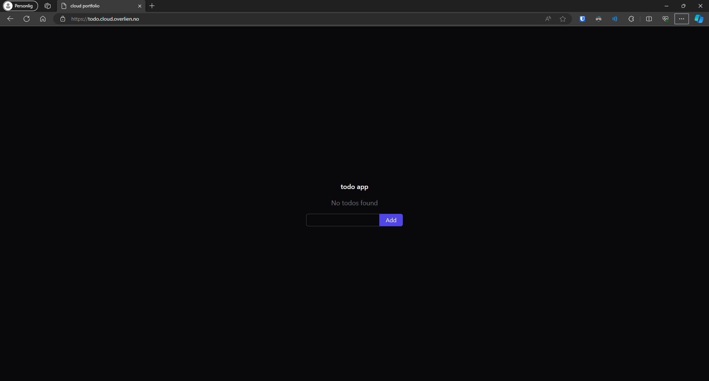
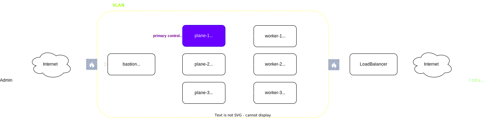
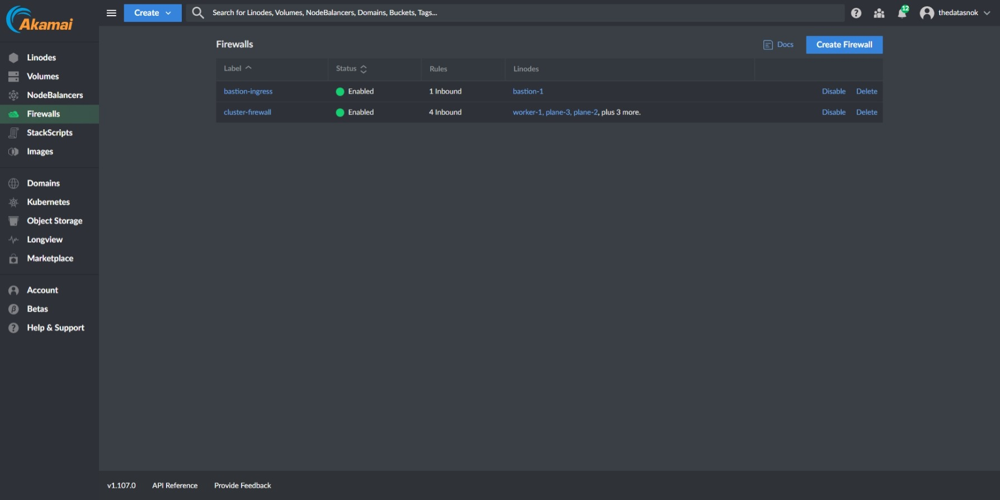
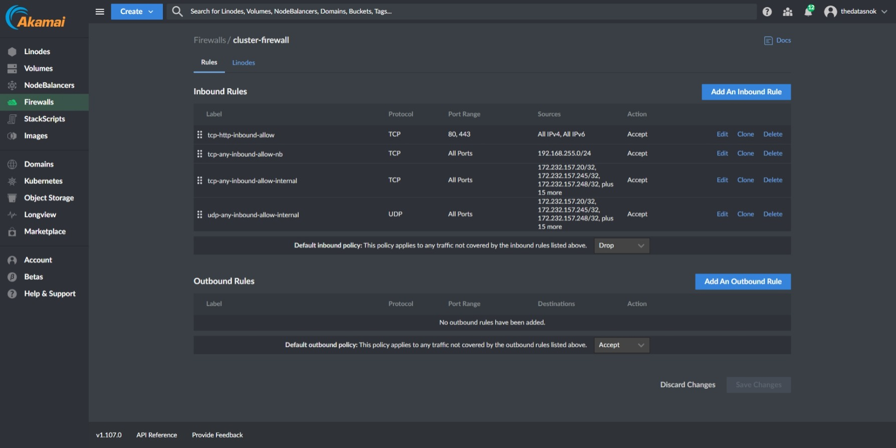
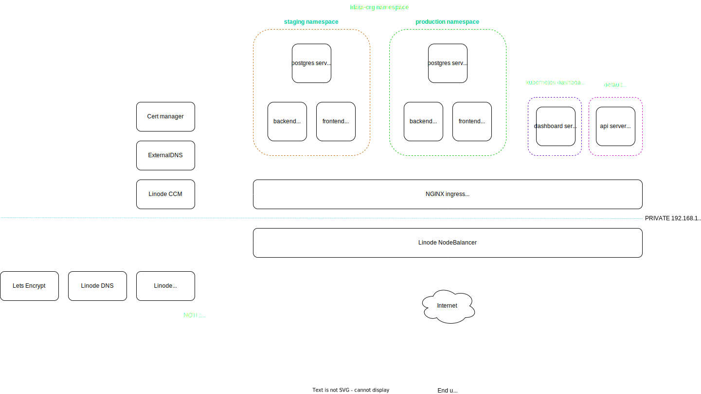
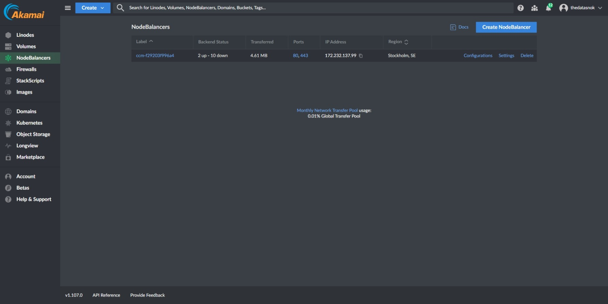
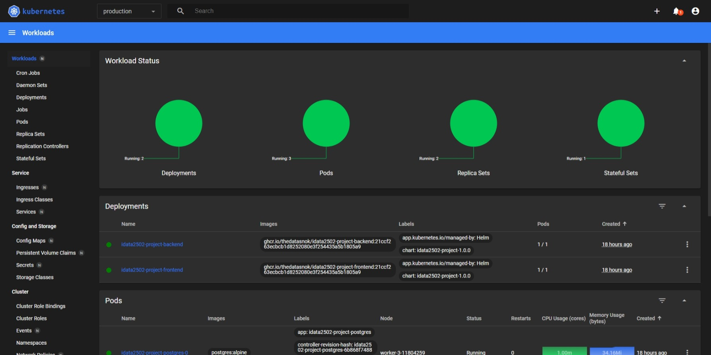
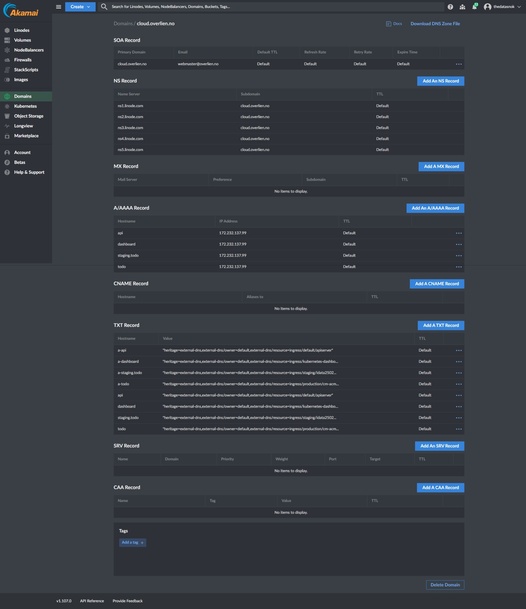
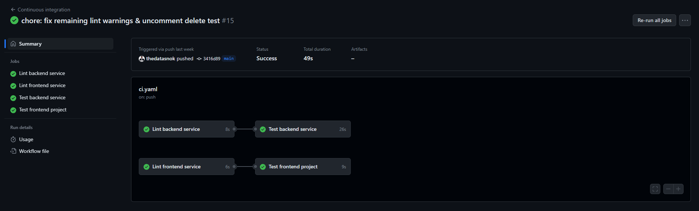
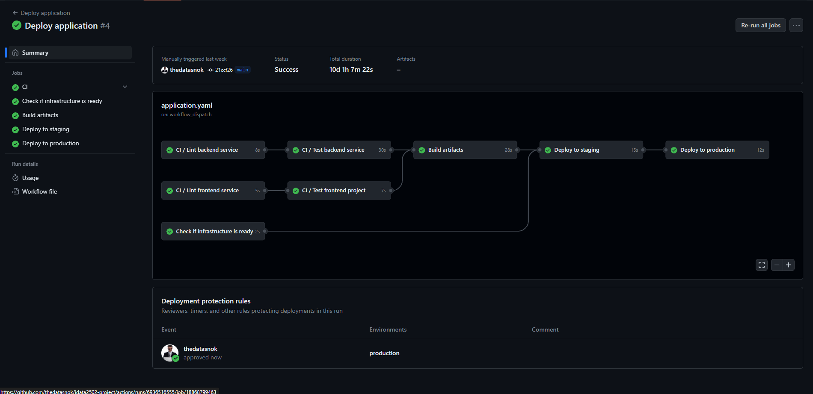

# IDATA2502: Portfolio project

## Table of Contents

[Introduction](#introduction)  
[Tools](#tools)  
[VM infrastructure](#vm-infrastructure)  
[K8s infrastructure](#k8s-infrastructure)  
[Pipeline](#pipeline)  
[Conclusion](#conclusion)

## Introduction

As part of the course IDATA2502 Cloud service administration, we are tasked to create a portfolio project.
The portfolio project rather was open-ended, allowing for us to define our own scopes and goals.
In my case, I wanted to create a pipeline for deploying a full stack web application on highly available infrastructure.

## Tools

In order to demonstrate how a pipeline like this can be set up, I have chosen a set of tools that I have partial familiarity from before.
Some of the tools were found during exploration in the course.

### Terraform

Terraform is a tool for defining infrastructure as code and is part of HashiCorps offering.
It has providers for a wide range of cloud providers, and allows for a declarative approach to infrastructure.

### Ansible

Ansible is a imperative tool for configuration management.
In this project I use it for configuring the environment after nodes are provisioned by Terraform.
In addition, Ansible is masterless making it well suited for a idempotent pipeline.

### Linode

Linode is the hosting provider of choice, it offers a relatively cheap pricing model and has APIs that Terraform can interact with.
This should be interchangable, but would require some setup for other cloud providers as well.

### K3s

Kubernetes itself may be challenging to set up on its own, using [kubeadm].
To simplify the process of creating a Kubernetes cluster, I use the K3s distribution as it is a shorter path of success.

### Helm 3

Helm is a package manager for Kubernetes, it allows for templating and packaging of Kubernetes resources. In this project I use it for templating the application resources when deploying to Kubernetes.

### GitHub Actions

GitHub Actions is a CI/CD tool that is built into GitHub, and is free for open source projects.
Other options include GitLab CI/CD, Jenkins, Travis CI and CircleCI, but I chose GitHub Actions as it is built into GitHub and has a wide range of community-made actions.

### HCP Vault Secrets

Vault Secrets is part of HashiCorp Cloud Platform, and is a managed service for storing secrets.
Vault Secrets comes with a set of integrations, including their own Terraform and GitHub Actions.

### Bun

Bun is a JavaScript/TypeScript runtime for building applications.

### ElysiaJS

ElysiaJS is a framework for building web applications in TypeScript using the Bun runtime.

### Drizzle

Drizzle is an ORM, object relational mapper, for TypeScript.
It allows for defining models and interacting with databases.
In addition it has support for generating migrations to keep the database schema in sync with the models.

### Solid.js

A web framework for building reactive web applications.

## Sample application

For demonstration purposes a sample application has been developed. The sample application is a relatively simple full stack "todo" web application, that consists of the following services:

- A Solid.js frontend service, written in TypeScript
- A Bun backend service, written in TypeScript using the ElysiaJS framework together with Drizzle for database access
- A Postgres database

The backend service has tests written using the Bun testing framework.

Both the backend and frontend services are expected to be publicly accessible. 

The following figure displays the UI of the application.



## VM infrastructure

The infrastructure is built up with a set of virtual machines, that are all placed within the same virtual network. They also have their own public IP addresses.
External traffic goes through a firewall and potentially a loadbalancer depending on the task at hand. For management, a bastion host is used to unify access to the nodes. The loadbalancer is typically used for web traffic to cluster resources.

The firewall rules are set up to allow traffic from anywhere from web traffic.



The following figures displays screenshots from the cloud providers web interface after the creation of the infrastructure.






## K8s infrastructure

Select nodes in the infrastructure are used to form a Kubernetes cluster, using the K3s distribution.
A subset of the nodes are installed as control plane nodes, and the remaining as worker nodes.
The control plane nodes are responsible for managing the cluster, and the worker nodes are responsible for running the workloads in the cluster.

The cluster is configured to allow a single control plane failure. [The etcd FAQ][etcd-faq] recommends odd-numbered clusters for failure tolerance as they will allow the same number of failure nodes with fewer nodes. The decision to set three is to allow a single node failure, while still balancing expenses to be within the free quota.

There is a few extras installed in the cluster when running the Ansible playbook. These are:

- [cert-manager][cert-manager] for managing certificates
- [NGINX Ingress Controller][nginx-ingress] for routing web traffic to cluster resources
- [External DNS][external-dns] for managing DNS records
- [Kubernetes dashboard][kubernetes-dashboard] for a visual overview of cluster resources
- [Hierarchical namespaces controller][kubernetes-hnc] for a more complex namespace structure
- [Longhorn][longhorn] for storage
- [Linode CCM][linode-ccm] for Linode NodeBalancer integration

This list can also be found in the [controlplane group_vars](../infrastructure/configuration/inventory/group_vars/controlplane/main.yml).

The following figure attempts to illustrate the Kubernetes install after applications are deployed to it.



The cluster itself is installed using a k3s Ansible role. The role installs k3s on control planes and worker nodes, and registers secondary nodes to the elected primary control node.

The application resources are defined as Helm templates. The services forming the application register necessary ingress definitions, and are as a result exposed to the internet. External DNS handles registering the domain names, and cert-manager handles issuing certificates for said domains.

The hierarchical namespace controller is used to better organize access to the cluster. This allows us to set up a parent namespace on cluster install, in which the application environments can be grouped by namespaces within. It allows using RBAC to grant access to the parent namespace for a Service Account. This service account can then be used to deploy resources within the parent namespace.

The following figure displays the nodebalancer created by the Linode CCM.



The following figure displays the workloads dashboard from the `production` namespace, containing the application resources.



After the domain is created in Linode by Terraform and the cluster is installed, it will start to populate A records for the used subdomains in ingress definitions.
The following figure is a screenshot of the domain in Linode after the cluster is fully installed, with all ingress definitions in place.



## Pipeline

This project facilitates the idea of a multiworkflow pipeline, where each workflow is responsible for a separate thing.
This is a result of different criteria for the frequency of runs of each workflow.

For instance the infrastructure pipeline does not have to be run unless there is a change in the infrastructure definition, where as the application deployment pipeline may be run on every push to the repository.

### Infrastructure pipeline

The infrastructure pipeline is responsible for provisioning the infrastructure that the application will be deployed on.
A set of nodes will be created, and Ansible will be used to configure the nodes.

#### Results


#### Security considerations

The pipeline creates a set of nodes, which get configured with `authorized_keys` for the user `root`, that will be used to run Ansible playbooks.
Private keys for the authorized keys are stored as GitHub secrets, and on my local machine. Public keys are defined in a shared [variable file](../infrastructure/configuration/vars.yml).

Strict host key checking is disabled for SSH connections made from GitHub Actions. This may potentially leave the pipeline vulnerable to man-in-the-middle attacks. To mitigate this we could manually verify the host keys or push them using a provisioner in Terraform to a central store. This would however require more work and has not been a priority for this project.

A Service Account for deploying the application will be created during this pipeline.
In order to deploy the application, we need a way to securely authenticate against the cluster.
To accomplish this, a Service Account is created in Kubernetes on install, and a token is generated for it.
This token will be read from the cluster and populated into HCP Vault Secrets in a Kubeconfig format.
The GitHub integration in HCP Vault Secrets will ensure that these variables are written into the repository secrets and thus made available to the deployment pipeline.

### Continuous integration pipeline

The continuous integration pipeline is responsible for making sure the application builds and passes tests.
In addition it is responsible for linting the code, and making sure that the code is formatted according to the set style guide.

The pipeline is run on every push to the repository, and on pull requests.
The backend service relies on the existence of a Postgres database, which is defined as a service in the pipeline.
Initially, the plan was to utilize [Testcontainers][testcontainers-node] for this, but it was not possible to interact with the Docker runtime in [Bun][bun].

#### Results



### Application deployment pipeline

The application deployment pipeline is responsible for delivering the application to the infrastructure, in different stages.
Deployment is split into two stages, staging and production. Staging acts as a pre-production environment, where changes can be verified before they are deployed to production. Staging deployments are automatic, when changes are made on the `main` branch in the repository. The production environment on the other hand, requires manual approval before it is deployed to.

Prior to deploying the application it will build artifacts and check that the infrastructure is in place by sending a simple HTTP request to the API server. If the request fails, it will not attempt the deployments.

To assure that quality is maintained, the pipeline will also re-run the CI pipeline prior to building and publishing artifacts for deployment.

In order to reduce the amount of repetition in the workflow file, the deployment has been abstracted into it's own [job file](../.github/actions/deploy-environment/action.yaml). The workflow steps per environment only has to define the variables the job takes in order to deploy the app. The job will create a target namespace to deploy into, and install the application resources using Helm.

#### Results



#### Security considerations

The pipeline will read a Kubeconfig from the repository secrets to authenticate to the cluster.
This config is generated during the infrastructure pipeline, and is scrubbed from pipeline logs.

The config uses a service account with access restricted to the `idata-org` namespace, and is only allowed to make changes in that namespace and its descendant namespaces. Access to descendant namespaces is granted through the hierarchical namespace controller.

## Challenges

### ExternalDNS Linode integration duplicate DNS records

In order to manage name server records, ExternalDNS had been set up in the cluster.

The Linode integration in ExternalDNS created a lot of duplicate records in the domain, resulting in the following error:

```
time="2023-12-01T13:31:14Z" level=error msg="Failed to Create record: [400] Record limit for this domain reached. Maximum records per domain is 12000." action=Create record=todo type=TXT zoneID=2860050 zoneName=cloud.overlien.no
```

This prevented ExternalDNS from creating new records, and as a result the production deployment was not accessible over internet. To resolve this ExternalDNS was upgraded to `0.14.0`.

## Conclusion

tbd.

[bun]: https://bun.sh/
[cert-manager]: https://cert-manager.io/
[external-dns]: https://github.com/kubernetes-sigs/external-dns
[etcd-faq]: https://etcd.io/docs/v3.6/faq/#what-is-failure-tolerance
[kubeadm]: https://kubernetes.io/docs/reference/setup-tools/kubeadm/
[kubernetes-dashboard]: https://kubernetes.io/docs/tasks/access-application-cluster/web-ui-dashboard/
[kubernetes-hnc]: https://github.com/kubernetes-sigs/hierarchical-namespaces
[longhorn]: https://longhorn.io/
[linode-ccm]: https://github.com/linode/linode-cloud-controller-manager
[nginx-ingress]: https://kubernetes.github.io/ingress-nginx/
[testcontainers-node]: https://node.testcontainers.org/
