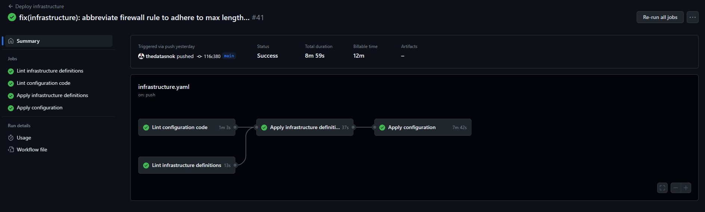

# IDATA2502: Portfolio project

## Table of Contents

## Motivation

As part of the course IDATA2502 Cloud service administration, we are tasked to create a portfolio project.
The portfolio project rather is open-ended, allowing for us to define our own scopes and goals.
In my case, I wanted to create a pipeline for deploying a full stack web application on highly available infrastructure.

## Tools

In order to demonstrate how a pipeline like this can be set up, I have chosen a set of tools that I have partial familiarity from before.
Some of the tools were found during exploration in the course.

### Terraform

Terraform is a tool for defining infrastructure as code.
In this project I use it for provisioning the environment.

### Ansible

Ansible is a tool for configuration management.
In this project I use it for configuring the environment after nodes are provisioned by Terraform.
In addition, Ansible is masterless making it well suited for a idempotent pipeline.

### Linode

Linode is the hosting provider of choice, it offers a relatively cheap pricing model and has APIs that Terraform can interact with.
This should be interchangable, but would require some setup for other cloud providers as well.

### K3s

Kubernetes itself may be challenging to set up on its own, using [kubeadm].
To simplify the process of creating a Kubernetes cluster, I use the K3s distribution as it is a shorter path of success.

### Helm 3

Helm is a package manager for Kubernetes, it allows for templating and packaging of Kubernetes resources. In this project I use it for templating the application resources when deploying to Kubernetes.

### GitHub Actions

In order to automate the pipeline, I use GitHub Actions.
It is a CI/CD tool that is built into GitHub, and is free for open source projects.
Other options include GitLab CI/CD, Jenkins, Travis CI and CircleCI, but I chose GitHub Actions as it is built into GitHub and has a wide range of community-made actions.

## Pipeline

This project facilitates the idea of a multiworkflow pipeline, where each workflow is responsible for a separate thing.
This is a result of different criteria for the frequency of runs of each workflow.

For instance the infrastructure pipeline does not have to be run unless there is a change in the infrastructure definition, where as the application deployment pipeline may be run on every push to the repository.

### Infrastructure pipeline

The infrastructure pipeline is responsible for provisioning the infrastructure that the application will be deployed on.
A set of nodes will be created, and Ansible will be used to configure the nodes.

#### Results

#### Security considerations

The pipeline creates a set of nodes, they are preconfigured with `authorized_keys` for the user `root`, that will be used to run Ansible playbooks.
Private keys for the authorized keys are stored as GitHub secrets, and on my local machine. Public keys are defined in a shared [variable file](../infrastructure/configuration/vars.yml).

Strict host key checking is disabled for SSH connections made from GitHub Actions. This may potentially leave the pipeline vulnerable to man-in-the-middle attacks. To mitigate this we could manually verify the host keys or push them using a provisioner in Terraform to a central store. This would however require more work and has not been a priority for this project.

### Continuous integration pipeline

The continuous integration pipeline is responsible for making sure the application builds and passes tests.
In addition it is responsible for linting the code, and making sure that the code is formatted according to the set style guide.

The pipeline is run on every push to the repository, and on pull requests.
The backend service relies on the existence of a Postgres database, which is defined as a service in the pipeline.
Initially, the plan was to utilize [Testcontainers][testcontainers-node] for this, but it was not possible to interact with the Docker runtime in [Bun][bun].

### Deployment pipeline

The deployment pipeline is responsible for delivering the application to the infrastructure, in different stages.
Deployment is split into two stages, staging and production. Staging acts as a pre-production environment, where changes can be verified before they are deployed to production. Staging deployments are automatic, when changes are made on the `main` branch in the repository. The production environment on the other hand, requires manual approval before it is deployed to.

[bun]: https://bun.sh/
[kubeadm]: https://kubernetes.io/docs/reference/setup-tools/kubeadm/
[testcontainers-node]: https://node.testcontainers.org/
