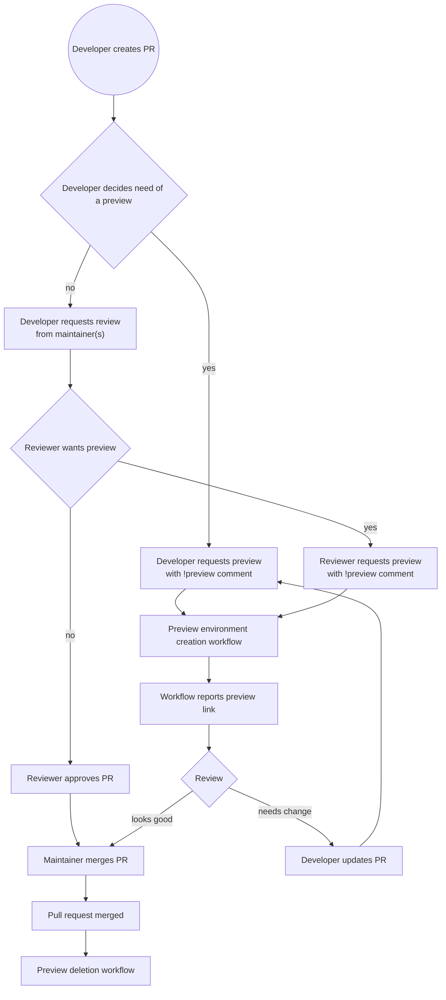

# IDATA2502: Portfolio project

## Table of Contents

## Motivation

As part of the course IDATA2502 Cloud service administration, we are tasked to create a portfolio project.
The portfolio project is open-ended, allowing for us to define our own scopes and goals.

During software development, we may end up making rapid changes that can be hard to validate.
By empowering testing methodologies and continuous integration, we can ensure that our are compatible with the rest of the system.
However, some changes may need customer feedback and/or validation from product specialists.
In order to accomplish this, we need to be able to deploy our changes to an environment, where these changes can be seen.
Deploying such changes to a production environment however, may be considered harmful to the business.

In order to solve this, we can create strategies for spawning environments as we need them to help in communicating the changes made.
Utilizing modern Infrastructure as Code solutions, we can automate the creation of such environments and ensure that they are almost identical to the production environment.
It will be necessary to have some key differentiators, such as domain names used potentially databases.

A simple way to accomplish this is by having separate stages. A simplistic approach to this is to have a staging environment and a production environment, whereas staging is meant to help in communicating changes to stakeholders.
This is a good and often satisfactory approach, but in some cases it may be nice to have one-off environments to preview changes that are not yet ready for staging.

## Tools

In order to demonstrate how a pipeline like this can be set up, I have chosen a set of tools that I have partial familiarity from before.
Some of the tools were found during exploration in the course.

### Terraform

Terraform is a tool for defining infrastructure as code.
In this project I use it for provisioning the environment.

### Ansible

Ansible is a tool for configuration management.
In this projecet I use it for configuring the environment after nodes are provisioned.
In addition, Ansible is masterless making it well suited for a idempotent pipeline.

### Linode

Linode is the hosting provider of choice, it offers a relatively cheap pricing model and has APIs that Terraform can interact with.
This should be interchangable, but would require some setup for other cloud providers as well.

### MicroK8s

Kubernetes itself may be challenging to set up on its own, using [kubeadm].
To simplify the process of creating a Kubernetes cluster, I use MicroK8s as it is a shorter path of success.

### GitHub Actions

In order to automate the pipeline, I use GitHub Actions.
It is a CI/CD tool that is built into GitHub, and is free for open source projects.
Other options include GitLab CI/CD, Jenkins, Travis CI and CircleCI, but I chose GitHub Actions as it is built into GitHub and has a wide range of community-made actions.

## Pipeline

This project facilitates the idea of a multiworkflow pipeline, where each workflow is responsible for a separate thing.
This is a result of different criteria for the frequency of runs of each workflow.

For instance the infrastructure pipeline does not have to be run unless there is a change in the infrastructure definition.

### Pull request preview workflows

[kubeadm]: https://sonofdog
