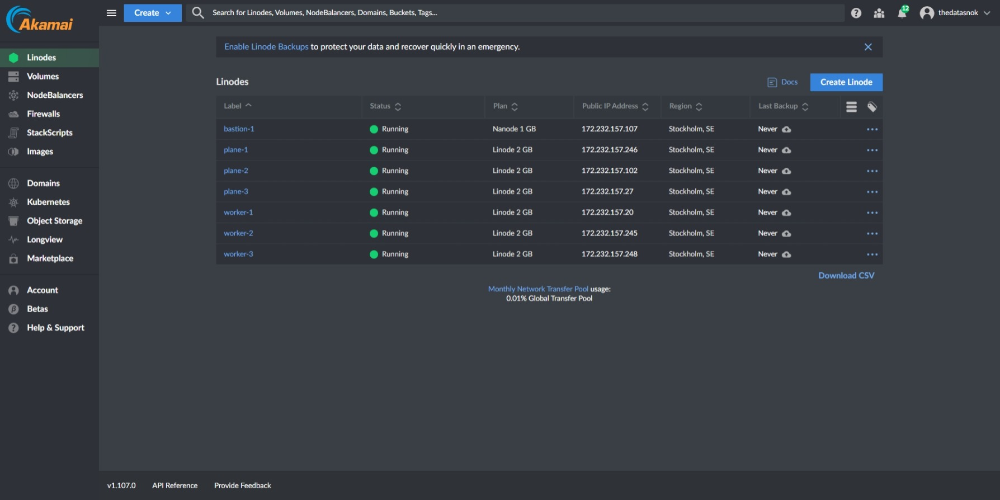
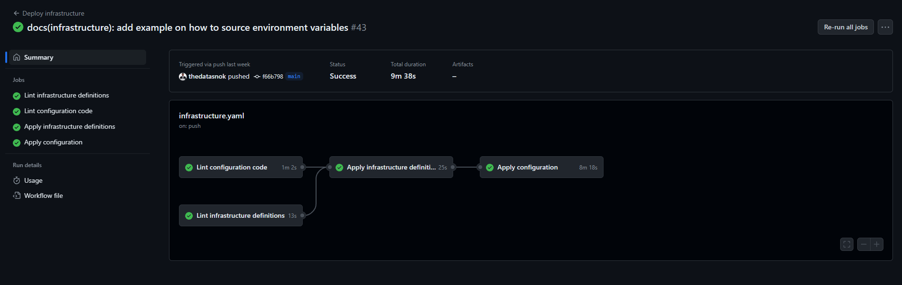

# Introduction

As part of the course IDATA2502 Cloud service administration, we are tasked to create a portfolio project.
The portfolio project rather was open-ended, allowing for us to define our own scopes and goals.
In my case, I wanted to create a pipeline for deploying a full stack web application on highly available infrastructure.

The project in its current state can be found at [github.com/thedatasnok/idata2502-project](https://github.com/thedatasnok/idata2502-project).

# Tools

In order to demonstrate how a pipeline like this can be set up, a set of tools have been chosen based on partial familiarity from before.
Other tools have been found during exploration in the course.

## Terraform

Terraform is a tool for defining infrastructure as code and is part of HashiCorps offering.
It has providers for a wide range of cloud providers, and allows for a declarative approach to infrastructure.

## Ansible

Ansible is a imperative tool for configuration management.
In this project it is used for configuring the environment after nodes are provisioned by Terraform.
In addition, Ansible is masterless making it well suited for a idempotent pipeline.

## Linode

Linode is the hosting provider of choice, it offers a relatively cheap pricing model and has APIs that Terraform can interact with.
This should be interchangable, but would require some setup for other cloud providers as well.

## K3s

Kubernetes itself may be challenging to set up on its own, using [kubeadm].
To simplify the process of creating a Kubernetes cluster, I use the K3s distribution as it is a shorter path of success.

## Helm 3

Helm is a package manager for Kubernetes, it allows for templating and packaging of Kubernetes resources.
This project uses it for templating the application resources when deploying to Kubernetes.

## GitHub Actions

GitHub Actions is a CI/CD tool that is built into GitHub, and is free for open source projects.
Other options include GitLab CI/CD, Jenkins, Travis CI and CircleCI, but I chose GitHub Actions as it is built into GitHub and has a wide range of community-made actions.

## HCP Vault Secrets

Vault Secrets is part of HashiCorp Cloud Platform, and is a managed service for storing secrets.
Vault Secrets comes with a set of integrations, including their own Terraform and GitHub Actions.

## Bun

Bun is a JavaScript/TypeScript runtime for building applications.

## ElysiaJS

ElysiaJS is a framework for building web applications in TypeScript using the Bun runtime.

## Drizzle

Drizzle is an ORM, object relational mapper, for TypeScript.
It allows for defining models and interacting with databases.
In addition it has support for generating migrations to keep the database schema in sync with the models.

## Solid.js

A web framework for building reactive web applications.

## Postgres

A relational database management system.

# Sample application

For demonstration purposes a sample application has been developed. The sample application is a relatively simple full stack "todo" web application, that consists of the following services:

- A Solid.js frontend service, written in TypeScript
- A Bun backend service, written in TypeScript using the ElysiaJS framework together with Drizzle for database access
- A Postgres instance

The backend service has tests written using the Bun testing framework.

Both the backend and frontend services are expected to be publicly accessible.


# VM infrastructure

The infrastructure is built up with a set of virtual machines, that are all placed within the same virtual network. They also have their own public IP addresses.
External traffic goes through a firewall and potentially a loadbalancer depending on the task at hand. For management, a bastion host is used to unify access to the nodes. The loadbalancer is in this case used to allow web traffic to cluster resources.

The firewall rules are set up to allow web traffic from anywhere.


The following figures displays screenshots from the cloud providers web interface after the creation of the infrastructure.




# Kubernetes infrastructure

Select nodes in the VM infrastructure are used to form a Kubernetes cluster, using the K3s distribution.
A subset of the nodes are installed as control plane nodes, and the remaining as worker nodes.
The control plane nodes are responsible for managing the cluster, and the worker nodes are responsible for running the workloads in the cluster.

The cluster is configured to allow a single control plane failure. It is recommended to deploy odd-numbered clusters for failure tolerance as they will allow the same number of failure nodes with fewer nodes. It is also reccomended for quorum in the cluster, meaning that the cluster nodes are able to agree on state updates [@etcd-faq]. The decision to set three is to allow a single node failure, while still balancing expenses to be within the free quota.

There are a few extras installed in the cluster when running the Ansible playbook. These are:

- [cert-manager][cert-manager] for managing certificates
- [NGINX Ingress Controller][nginx-ingress] for routing web traffic to cluster resources
- [External DNS][external-dns] for managing DNS records
- [Kubernetes dashboard][kubernetes-dashboard] for a visual overview of cluster resources
- [Hierarchical namespaces controller][kubernetes-hnc] for a more complex namespace structure
- [Longhorn][longhorn] for storage
- [Linode CCM][linode-ccm] for Linode NodeBalancer integration

This list can also be found in the [controlplane group_vars](https://github.com/thedatasnok/idata2502-project/tree/main/infrastructure/configuration/inventory/group_vars/controlplane/main.yml).

The following figure attempts to illustrate the Kubernetes install after applications are deployed to it.


The cluster itself is installed using a k3s Ansible role. The role installs k3s on control planes and worker nodes, and registers secondary nodes to the elected primary control node.

The application resources are defined as Helm templates. The services forming the application register necessary ingress definitions, and are as a result exposed to the internet. External DNS handles registering the domain names, and cert-manager handles issuing certificates for said domains.

The hierarchical namespace controller is used to better organize access to the cluster. This allows us to set up a parent namespace on cluster install, in which the application environments can be grouped by namespaces within. It allows using RBAC to grant access to the parent namespace for a Service Account. This service account can then be used to deploy resources within the parent namespace.


The following figure displays the workloads dashboard from the `production` namespace, containing the application resources.


After the domain is created in Linode by Terraform and the cluster is installed, it will start to populate A records for the used subdomains in ingress definitions.
The following figure is a screenshot of the domain in Linode after the cluster is fully installed, with all ingress definitions in place.


# Pipeline

This project facilitates the idea of a multiworkflow pipeline, where each workflow is responsible for a separate thing.
This is a result of different criteria for the frequency of runs of each workflow.

For instance the infrastructure pipeline does not have to be run unless there is a change in the infrastructure definition, where as the application deployment pipeline may be run on every push to the repository.

## Infrastructure pipeline

The infrastructure pipeline is responsible for provisioning the infrastructure that the application will be deployed on.
A set of nodes will be created using Terraform, and Ansible will be used to configure the nodes.

In order for the infrastructure to work as intended, changes need to be made in the used domain registrar. The domain name specified in the variable file needs to be forwarded to Linodes nameservers.

For a `cloud` subdomain it can be accomplished by adding the following records:

```
NS  cloud   ns1.linode.com
NS  cloud   ns2.linode.com
NS  cloud   ns3.linode.com
NS  cloud   ns4.linode.com
NS  cloud   ns5.linode.com
```

### Definition

The Ansible and Terraform code run in this pipeline can be found in the repository under [the `infrastructure` directory](https://github.com/thedatasnok/idata2502-project/tree/main/infrastructure).

```yaml
name: Deploy infrastructure

on:
  push:
    branches:
      - main
    paths:
      - 'infrastructure/**'
      - '!infrastructure/README.md'
  workflow_dispatch:

jobs:
  lint_infrastructure:
    name: Lint infrastructure definitions
    runs-on: ubuntu-latest
    if: ${{ !contains(github.event.head_commit.message, '[ci skip]') }}
    steps:
      - name: Checkout
        uses: actions/checkout@v4

      - name: Setup terraform
        uses: hashicorp/setup-terraform@v3
        with:
          cli_config_credentials_token: ${{ secrets.TF_API_TOKEN }}

      - name: Check formatting
        working-directory: ./infrastructure/definition
        run: terraform fmt -check

      - name: Initialize terraform
        working-directory: ./infrastructure/definition
        run: terraform init

      - name: Validate definitions
        working-directory: ./infrastructure/definition
        run: terraform validate -no-color

  apply_infrastructure:
    name: Apply infrastructure definitions
    runs-on: ubuntu-latest
    needs: lint_infrastructure
    permissions:
      contents: write
    steps:
      - name: Checkout
        uses: actions/checkout@v4

      - name: Setup terraform
        uses: hashicorp/setup-terraform@v3
        with:
          cli_config_credentials_token: ${{ secrets.TF_API_TOKEN }}

      - name: Initialize terraform
        working-directory: infrastructure/definition
        run: terraform init

      - name: Apply terraform
        working-directory: infrastructure/definition
        run: terraform apply -auto-approve

      - name: Write inventory changes
        working-directory: infrastructure/definition
        run: terraform output -raw ansible_inventory > ../configuration/inventory/hosts.yml

      - name: Configure git author
        run: |
          git config user.name github-actions
          git config user.email github-actions@github.com

      - name: Stage, commit and push inventory changes
        run: tools/conditional-commit-inventory.sh

  lint_configuration:
    name: Lint configuration code
    runs-on: ubuntu-latest
    steps:
      - name: Checkout
        uses: actions/checkout@v4

      - name: Install python
        uses: actions/setup-python@v4
        with:
          python-version: '3.10'

      - name: Install ansible
        run: |
          python -m pip install --upgrade pip
          python -m pip install --user ansible
          python -m pip install --user jmespath

      - name: Install requirements from Ansible galaxy
        working-directory: infrastructure/configuration
        run: ansible-galaxy install -r requirements.yml

      - name: Run ansible lint
        uses: ansible/ansible-lint@v6

  apply_configuration:
    name: Apply configuration
    runs-on: ubuntu-latest
    needs:
      - lint_configuration
      - apply_infrastructure
    defaults:
      run:
        working-directory: infrastructure/configuration

    steps:
      - name: Checkout
        uses: actions/checkout@v4

      - name: Prepare SSH client
        run: |
          mkdir -p ~/.ssh/
          touch ~/.ssh/id_rsa
          touch ~/.ssh/known_hosts
          echo -e "${{secrets.SSH_PRIVATE_KEY}}" > ~/.ssh/id_rsa
          chmod 600 ~/.ssh/id_rsa
          chmod 600 ~/.ssh/known_hosts
          cat >>~/.ssh/config <<END
          Host *
            StrictHostKeyChecking no
          END

      - name: Install python
        uses: actions/setup-python@v4
        with:
          python-version: '3.10'

      - name: Install ansible
        run: |
          python -m pip install --upgrade pip
          python -m pip install --user ansible
          python -m pip install --user jmespath

      - name: Install requirements from Ansible galaxy
        run: ansible-galaxy install -r requirements.yml

      - name: Run install cluster playbook
        env:
          HCP_CLIENT_ID: ${{ secrets.HCP_CLIENT_ID }}
          HCP_CLIENT_SECRET: ${{ secrets.HCP_CLIENT_SECRET }}
          HCP_VS_ORGANIZATION_ID: ${{ secrets.HCP_VS_ORGANIZATION_ID }}
          HCP_VS_PROJECT_ID: ${{ secrets.HCP_VS_PROJECT_ID }}
          HCP_VS_APP_ID: ${{ secrets.HCP_VS_APP_ID }}
          ANSIBLE_HOST_KEY_CHECKING: False
        run: ansible-playbook playbooks/install-cluster.yml -i inventory/hosts.yml
```

### Results



### Security considerations

The pipeline creates a set of nodes, which get configured with `authorized_keys` for the user `root`, that will be used to run Ansible playbooks.
Private keys for the authorized keys are stored as GitHub secrets, and on my local machine. Public keys are defined in a shared [variable file](../infrastructure/configuration/vars.yml).

Strict host key checking is disabled for SSH connections made from GitHub Actions. This may potentially leave the pipeline vulnerable to man-in-the-middle attacks. To mitigate this we could manually verify the host keys or push them using a provisioner in Terraform to a central store. This would however require more work and has not been a priority for this project.

A Service Account for deploying the application will be created during this pipeline.
In order to deploy the application, we need a way to securely authenticate against the cluster.
To accomplish this, a Service Account is created in Kubernetes on install, and a token is generated for it.
This token will be read from the cluster and populated into HCP Vault Secrets in a Kubeconfig format.
The GitHub integration in HCP Vault Secrets will ensure that these variables are written into the repository secrets and thus made available to the deployment pipeline.

## Continuous integration pipeline

The continuous integration pipeline is responsible for making sure the application builds and passes tests.
In addition it is responsible for linting the code, and making sure that the code is formatted according to the set style guide.

The pipeline is run on every push to the repository, and on pull requests.
The backend service relies on the existence of a Postgres database, which is defined as a service in the pipeline.
Initially, the plan was to utilize [Testcontainers][testcontainers-node] for this, but it was not possible to interact with the Docker runtime in [Bun][bun].

### Definition

The source code for the applications checked in this pipeline can be found in the repository under [the `services` directory](https://github.com/thedatasnok/idata2502-project/tree/main/services).

```yaml
name: Continuous integration

on:
  push:
    branches:
      - main
    paths:
      - services/backend/**
      - services/frontend/**
  pull_request:
    branches:
      - main
    paths:
      - services/backend/**
      - services/frontend/**
  workflow_call:

jobs:
  lint_backend:
    name: Lint backend service
    runs-on: ubuntu-latest
    steps:
      - name: Checkout
        uses: actions/checkout@v4

      - name: Set up bun
        uses: oven-sh/setup-bun@v1

      - name: Install dependencies
        run: bun install

      - name: Lint backend
        run: bun lint:backend

  lint_frontend:
    name: Lint frontend service
    runs-on: ubuntu-latest
    steps:
      - name: Checkout
        uses: actions/checkout@v4

      - name: Set up bun
        uses: oven-sh/setup-bun@v1

      - name: Install dependencies
        run: bun install

      - name: Lint frontend
        run: bun lint:frontend

  test_backend:
    name: Test backend service
    runs-on: ubuntu-latest
    needs:
      - lint_backend
    services:
      postgres:
        image: postgres:alpine
        ports:
          - 5432:5432
        options: >-
          --health-cmd pg_isready
          --health-interval 10s
          --health-timeout 5s
          --health-retries 5
        env:
          POSTGRES_USER: postgres
          POSTGRES_PASSWORD: postgres
          POSTGRES_DB: postgres
    env:
      POSTGRES_HOST: localhost
      POSTGRES_PORT: 5432
      POSTGRES_USER: postgres
      POSTGRES_PASSWORD: postgres
    steps:
      - name: Checkout
        uses: actions/checkout@v4

      - name: Set up bun
        uses: oven-sh/setup-bun@v1

      - name: Install dependencies
        run: bun install

      - name: Prepare database
        working-directory: services/backend
        run: bun db:migrate

      - name: Test backend
        working-directory: services/backend
        run: bun test

  test_frontend:
    name: Test frontend project
    runs-on: ubuntu-latest
    needs:
      - lint_frontend
    steps:
      - name: Checkout
        uses: actions/checkout@v4

      - name: Set up bun
        uses: oven-sh/setup-bun@v1

      - name: Install dependencies
        run: bun install

      - name: Test frontend
        working-directory: services/frontend
        run: bun test
```

### Results


\newpage

## Application deployment pipeline

The application deployment pipeline is responsible for delivering the application to the infrastructure, in different stages.
Deployment is split into two stages, staging and production. Staging acts as a pre-production environment, where changes can be verified before they are deployed to production. Staging deployments are automatic, when changes are made on the `main` branch in the repository. The production environment on the other hand, requires manual approval before it is deployed to.

The two environments are defined in GitHub, and are configured with a differing URL in a variable.
The URLs used are `staging.cloud.overlien.no` and `cloud.overlien.no`.

Prior to deploying the application it will build artifacts and check that the infrastructure is in place by sending a simple HTTP request to the API server. If the request fails, it will not attempt the deployments.

To assure that quality is maintained, the pipeline will also re-run the CI pipeline prior to building and publishing artifacts for deployment.

In order to reduce the amount of repetition in the workflow file, the deployment has been abstracted into it's own [job file](../.github/actions/deploy-environment/action.yaml). The workflow steps per environment only has to define the variables the job takes in order to deploy the app. The job will create a target namespace to deploy into, and install the application resources using Helm.

### Definition

The source code and Dockerfiles for the applications built in this pipeline can be found in the repository under [the `services` directory](https://github.com/thedatasnok/idata2502-project/tree/main/services).

The Helm chart defining the Kubernetes resources can be found in the repository under [the `helm` directory](https://github.com/thedatasnok/idata2502-project/tree/main/helm).

The job file for deploying the application can be found in the repository under [the `.github/actions/deploy-environment` directory](https://github.com/thedatasnok/idata2502-project/tree/main/.github/actions/deploy-environment/action.yaml).

```yaml
name: Deploy application

on:
  push:
    tags:
      - '*'
    branches:
      - main
    paths:
      - services/backend/**
      - services/frontend/**
  workflow_dispatch:

jobs:
  continuous_integration:
    name: CI
    uses: ./.github/workflows/ci.yaml

  build_artifacts:
    name: Build artifacts
    runs-on: ubuntu-latest
    needs:
      - continuous_integration
    permissions:
      packages: write
      contents: read
    steps:
      - name: Checkout
        uses: actions/checkout@v4

      - name: Set up docker
        uses: docker/setup-qemu-action@v3

      - name: Set up Docker Buildx
        uses: docker/setup-buildx-action@v3

      - name: Log in to GitHub Container Registry
        uses: docker/login-action@v3
        with:
          registry: ghcr.io
          username: ${{ github.actor }}
          password: ${{ secrets.GITHUB_TOKEN }}

      - name: Build and push backend container image
        uses: docker/build-push-action@v3
        with:
          context: .
          file: services/backend/Dockerfile
          push: true
          tags: |
            ghcr.io/thedatasnok/idata2502-project-backend:${{ github.sha }}
            ghcr.io/thedatasnok/idata2502-project-backend:latest

      - name: Build and push frontend container image
        uses: docker/build-push-action@v3
        with:
          context: .
          file: services/frontend/Dockerfile
          push: true
          tags: |
            ghcr.io/thedatasnok/idata2502-project-frontend:${{ github.sha }}
            ghcr.io/thedatasnok/idata2502-project-frontend:latest

  check_infrastructure_ready:
    name: Check if infrastructure is ready
    runs-on: ubuntu-latest
    steps:
      - name: Attempt a HTTP request to K8S api
        run: |
          response=$(curl -s -o /dev/null -I -w "%{http_code}" ${{ vars.K8S_URL }})
          if [ $? -eq 0 ]; then
            echo "Service is responding. Response code: $response"
          else
            echo "Failed to connect to the service, stopping the workflow."
            exit 1
          fi

  deploy_staging:
    name: Deploy to staging
    runs-on: ubuntu-latest
    environment: staging
    needs:
      - build_artifacts
      - check_infrastructure_ready
    steps:
      - name: Checkout
        uses: actions/checkout@v4

      - name: Deploy environment
        uses: ./.github/actions/deploy-environment
        with:
          environment: staging
          kubeconfig: ${{ secrets.PIPELINE_KUBECONFIG }}
          github-token: ${{ secrets.GITHUB_TOKEN }}
          hostname: ${{ vars.HOSTNAME }}
          cluster-issuer: letsencrypt
          tag: ${{ github.sha }}

  deploy_production:
    name: Deploy to production
    needs: deploy_staging
    runs-on: ubuntu-latest
    environment: production
    steps:
      - name: Checkout
        uses: actions/checkout@v4

      - name: Deploy environment
        uses: ./.github/actions/deploy-environment
        with:
          environment: production
          kubeconfig: ${{ secrets.PIPELINE_KUBECONFIG }}
          github-token: ${{ secrets.GITHUB_TOKEN }}
          hostname: ${{ vars.HOSTNAME }}
          cluster-issuer: letsencrypt
          tag: ${{ github.sha }}
```

### Results


### Security considerations

The pipeline will read a Kubeconfig from the repository secrets to authenticate to the cluster.
This config is generated during the infrastructure pipeline, and is scrubbed from pipeline logs.

The config uses a service account with access restricted to the `idata-org` namespace, and is only allowed to make changes in that namespace and its descendant namespaces. Access to descendant namespaces is granted through the hierarchical namespace controller.

# Challenges

## ExternalDNS Linode integration duplicate DNS records

In order to manage name server records, ExternalDNS had been set up in the cluster.

The Linode integration in ExternalDNS created a lot of duplicate records in the domain, resulting in the following error:

```
time="2023-12-01T13:31:14Z" level=error msg="Failed to Create record: [400] Record limit for this domain reached. Maximum records per domain is 12000." action=Create record=todo type=TXT zoneID=2860050 zoneName=cloud.overlien.no
```

This prevented ExternalDNS from creating new records, and as a result the production deployment was not accessible over internet. To resolve this ExternalDNS was upgraded to `0.14.0`.

# Reflections

The project has been a good experience with a fair share of learning. The student had not yet used Terraform or Ansible for something meaningful and it was a good way of gaining familiarity with both of these tools. The student had used Kubernetes before, but not this exact distribution and set of tools on top. The student had also used GitHub Actions before, but not in an as complicated fashion as this project.

During the project some were challenges were faced. Dynamic inventorying and SSH connections to nodes is one of them. The host key signatures would rotate when the environment was re-created, however this was overcome by disabling StrictHostKeyChecking in the SSH client. Another challenge was the integration with Linode, as ExternalDNS created a lot of duplicate records in the domain, resulting in the production deployment being inaccessible. This was resolved by upgrading ExternalDNS to a newer version.

# Conclusion

The student feels that this project has been a good learning experience. Through the project the student had set up a multiworkflow pipeline for deploying a full stack web application to infrastructure hosted in Linode. The application runs as containers within a Kubernetes cluster. The cluster provisioned by Terraform and configured by Ansible. During the project some challenges were faced with different technologies, but the student is satisfied with the overall result of the project.

# References

[bun]: https://bun.sh/
[cert-manager]: https://cert-manager.io/
[external-dns]: https://github.com/kubernetes-sigs/external-dns
[etcd-faq]: https://etcd.io/docs/v3.6/faq/#what-is-failure-tolerance
[kubeadm]: https://kubernetes.io/docs/reference/setup-tools/kubeadm/
[kubernetes-dashboard]: https://kubernetes.io/docs/tasks/access-application-cluster/web-ui-dashboard/
[kubernetes-hnc]: https://github.com/kubernetes-sigs/hierarchical-namespaces
[longhorn]: https://longhorn.io/
[linode-ccm]: https://github.com/linode/linode-cloud-controller-manager
[nginx-ingress]: https://kubernetes.github.io/ingress-nginx/
[testcontainers-node]: https://node.testcontainers.org/
